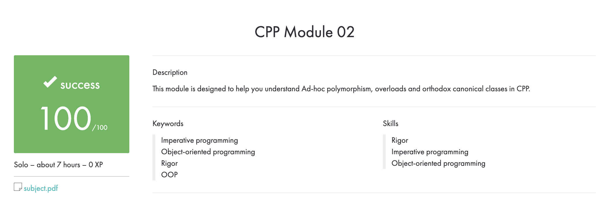

# CPP_Module_02
## This module is designed to help you understand Ad-hoc polymorphism, overloads and orthodox canonical classes in CPP.

## Subject
**The assignment is here!** [(link)](https://github.com/AtaullinShamil/42-CPP_Module/blob/main/CPP_Module_02/includes/cpp_02.pdf)
