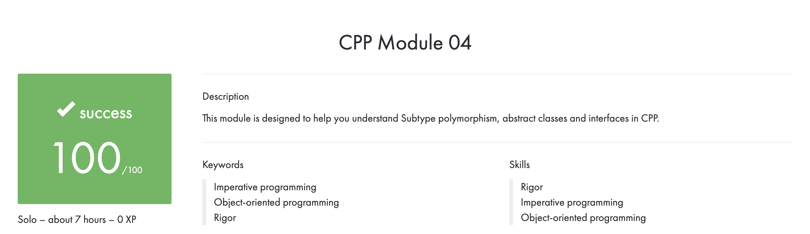

# CPP_Module_04
## This module is designed to help you understand Subtype polymorphism, abstract classes and interfaces in CPP.

## Subject
**The assignment is here!** [(link)](https://github.com/AtaullinShamil/42-CPP_Module/blob/main/CPP_Module_04/includes/cpp_04.pdf)
