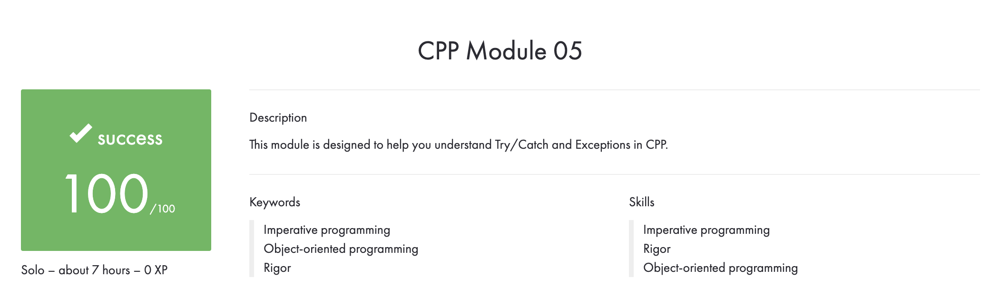

# CPP_Module_05
## This module is designed to help you understand Try/Catch and Exceptions in CPP.

## Subject
**The assignment is here!** [(link)](https://github.com/AtaullinShamil/42-CPP_Module/blob/main/CPP_Module_05/includes/cpp_05.pdf)
