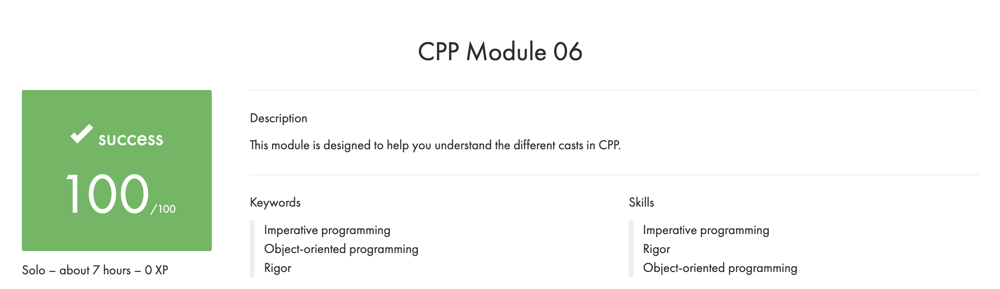

# CPP_Module_06
## This module is designed to help you understand the different casts in CPP.

## Subject
**The assignment is here!** [(link)](https://github.com/AtaullinShamil/42-CPP_Module/blob/main/CPP_Module_06/includes/cpp_06.pdf)
