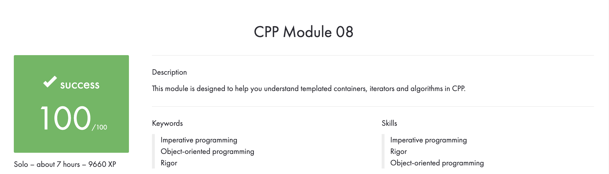

# CPP_Module_08
## This module is designed to help you understand templated containers, iterators and algorithms in CPP.

## Subject
**The assignment is here!** [(link)](https://github.com/AtaullinShamil/42-CPP_Module/blob/main/CPP_Module_08/includes/cpp_08.pdf)
